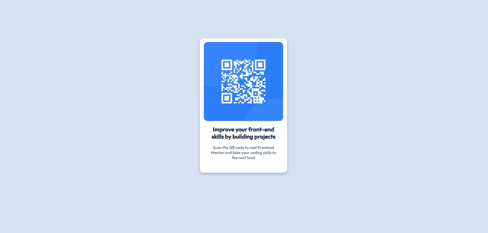

# QR-Code Component

This is a solution to the [QR code component challenge on Frontend Mentor](https://www.frontendmentor.io/challenges/qr-code-component-iux_sIO_H). Frontend Mentor challenges help you improve your coding skills by building realistic projects. 

## Table of Contents
- [Overview](#overview)
- [Screenshots](#screenshots)
- [Links](#links)
- [Built with](#built-with)
- [Author](#author)

# Overview

This is a mini non functioning qr-code component .

# Screenshots

Destop Design

 

Mobile Design

# Links

- Repository Url: [QR-Code Component](https://github.com/shees360/QR-Code-Component.git)
- Live Url - 

# Built with

- Semantic HTML5 markup
- Custom CSS properties

# Author

- Name: shees

- Frontend-Mentor: [@shees360](#)
